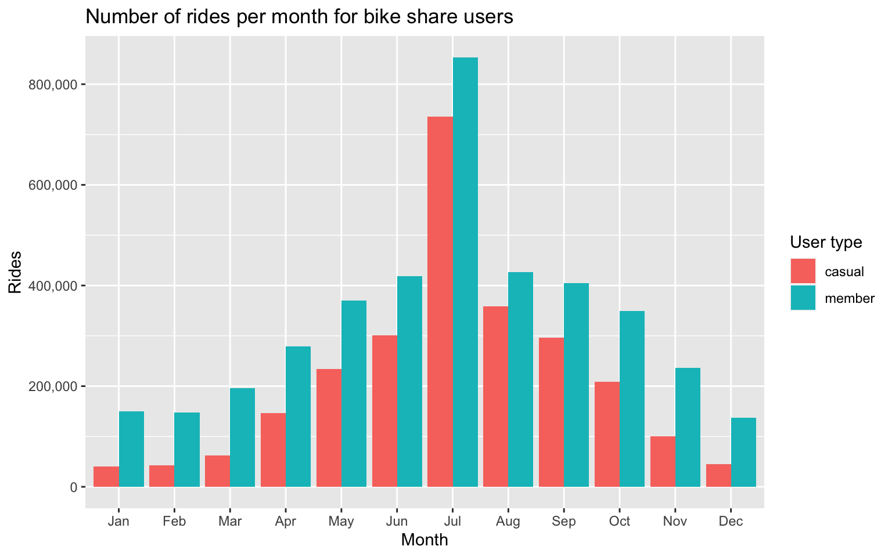
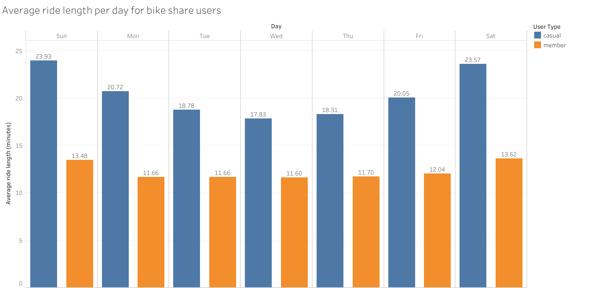
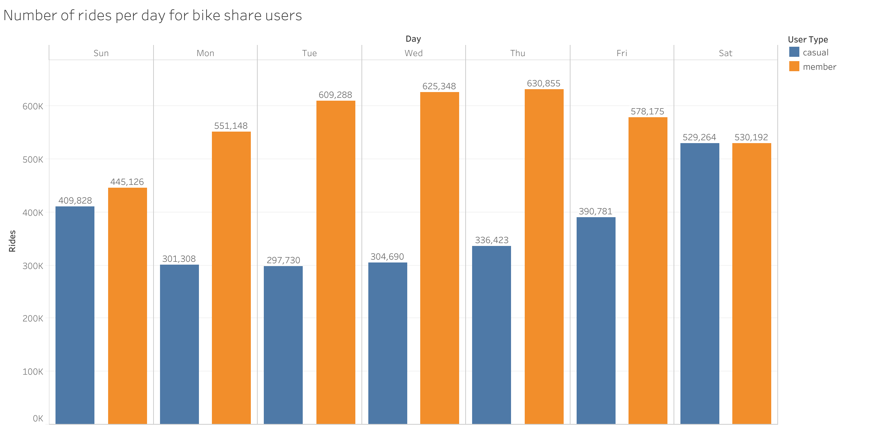
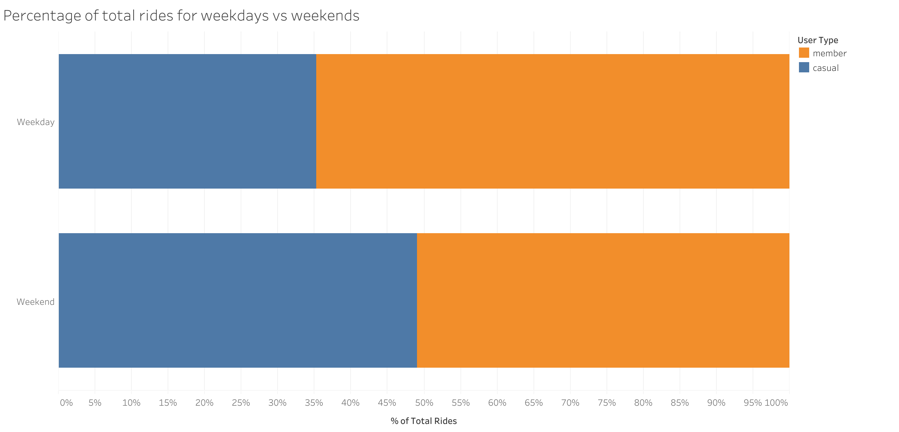
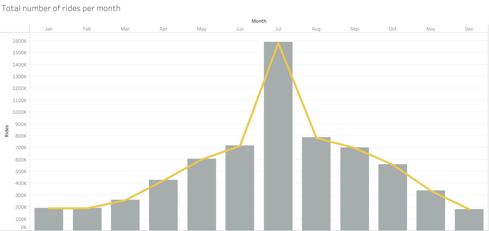

## Introduction

This report is based on a case study from the [Google Data Analytics course](https://www.coursera.org/professional-certificates/google-data-analytics). The scenario is the following:

> You are a junior data analyst working in the marketing analyst team at Cyclistic, a bike-share company in Chicago. The director of marketing believes the company's future success depends on maximizing the number of annual memberships. Therefore, your team wants to understand how casual riders and annual members use Cyclistic bikes differently. From these insights, your team will design a new marketing strategy to convert casual riders into annual members. But first, Cyclistic executives must approve your recommendations, so they must be backed up with compelling data insights and professional data visualizations.

The business question we want to answer is...

> How do annual members and casual riders use Cyclistic bikes differently?

## Data

The data can be accessed [here](https://divvy-tripdata.s3.amazonaws.com/index.html). This report includes data from the past 12 months (July 2022 to July 2023).

### Setup

Most of the work completed will be done using R. However, official visualizations will be made using Tableau.

The first thing we want to do is load the necessary packages to work with the data efficiently.

``` r
library(tidyverse)
```

    ── Attaching core tidyverse packages ──────────────────────── tidyverse 2.0.0 ──
    ✔ dplyr     1.1.2     ✔ readr     2.1.4
    ✔ forcats   1.0.0     ✔ stringr   1.5.0
    ✔ ggplot2   3.4.3     ✔ tibble    3.2.1
    ✔ lubridate 1.9.2     ✔ tidyr     1.3.0
    ✔ purrr     1.0.2     
    ── Conflicts ────────────────────────────────────────── tidyverse_conflicts() ──
    ✖ dplyr::filter() masks stats::filter()
    ✖ dplyr::lag()    masks stats::lag()
    ℹ Use the conflicted package (<http://conflicted.r-lib.org/>) to force all conflicts to become errors

``` r
library(scales)
```


    Attaching package: 'scales'

    The following object is masked from 'package:purrr':

        discard

    The following object is masked from 'package:readr':

        col_factor

The data for each month has been downloaded separately, so it must first be loaded into R and combined.

``` r
july_2022 <- read_csv("202207-divvy-tripdata.csv")
```

    Rows: 823488 Columns: 13
    ── Column specification ────────────────────────────────────────────────────────
    Delimiter: ","
    chr  (7): ride_id, rideable_type, start_station_name, start_station_id, end_...
    dbl  (4): start_lat, start_lng, end_lat, end_lng
    dttm (2): started_at, ended_at

    ℹ Use `spec()` to retrieve the full column specification for this data.
    ℹ Specify the column types or set `show_col_types = FALSE` to quiet this message.

``` r
august_2022 <- read_csv("202208-divvy-tripdata.csv")
```

    Rows: 785932 Columns: 13
    ── Column specification ────────────────────────────────────────────────────────
    Delimiter: ","
    chr  (7): ride_id, rideable_type, start_station_name, start_station_id, end_...
    dbl  (4): start_lat, start_lng, end_lat, end_lng
    dttm (2): started_at, ended_at

    ℹ Use `spec()` to retrieve the full column specification for this data.
    ℹ Specify the column types or set `show_col_types = FALSE` to quiet this message.

``` r
september_2022 <- read_csv("202209-divvy-tripdata.csv")
```

    Rows: 701339 Columns: 13
    ── Column specification ────────────────────────────────────────────────────────
    Delimiter: ","
    chr  (7): ride_id, rideable_type, start_station_name, start_station_id, end_...
    dbl  (4): start_lat, start_lng, end_lat, end_lng
    dttm (2): started_at, ended_at

    ℹ Use `spec()` to retrieve the full column specification for this data.
    ℹ Specify the column types or set `show_col_types = FALSE` to quiet this message.

``` r
october_2022 <- read_csv("202210-divvy-tripdata.csv")
```

    Rows: 558685 Columns: 13
    ── Column specification ────────────────────────────────────────────────────────
    Delimiter: ","
    chr  (7): ride_id, rideable_type, start_station_name, start_station_id, end_...
    dbl  (4): start_lat, start_lng, end_lat, end_lng
    dttm (2): started_at, ended_at

    ℹ Use `spec()` to retrieve the full column specification for this data.
    ℹ Specify the column types or set `show_col_types = FALSE` to quiet this message.

``` r
november_2022 <- read_csv("202211-divvy-tripdata.csv")
```

    Rows: 337735 Columns: 13
    ── Column specification ────────────────────────────────────────────────────────
    Delimiter: ","
    chr  (7): ride_id, rideable_type, start_station_name, start_station_id, end_...
    dbl  (4): start_lat, start_lng, end_lat, end_lng
    dttm (2): started_at, ended_at

    ℹ Use `spec()` to retrieve the full column specification for this data.
    ℹ Specify the column types or set `show_col_types = FALSE` to quiet this message.

``` r
december_2022 <- read_csv("202212-divvy-tripdata.csv")
```

    Rows: 181806 Columns: 13
    ── Column specification ────────────────────────────────────────────────────────
    Delimiter: ","
    chr  (7): ride_id, rideable_type, start_station_name, start_station_id, end_...
    dbl  (4): start_lat, start_lng, end_lat, end_lng
    dttm (2): started_at, ended_at

    ℹ Use `spec()` to retrieve the full column specification for this data.
    ℹ Specify the column types or set `show_col_types = FALSE` to quiet this message.

``` r
january_2023 <- read_csv("202301-divvy-tripdata.csv")
```

    Rows: 190301 Columns: 13
    ── Column specification ────────────────────────────────────────────────────────
    Delimiter: ","
    chr  (7): ride_id, rideable_type, start_station_name, start_station_id, end_...
    dbl  (4): start_lat, start_lng, end_lat, end_lng
    dttm (2): started_at, ended_at

    ℹ Use `spec()` to retrieve the full column specification for this data.
    ℹ Specify the column types or set `show_col_types = FALSE` to quiet this message.

``` r
february_2023 <- read_csv("202302-divvy-tripdata.csv")
```

    Rows: 190445 Columns: 13
    ── Column specification ────────────────────────────────────────────────────────
    Delimiter: ","
    chr  (7): ride_id, rideable_type, start_station_name, start_station_id, end_...
    dbl  (4): start_lat, start_lng, end_lat, end_lng
    dttm (2): started_at, ended_at

    ℹ Use `spec()` to retrieve the full column specification for this data.
    ℹ Specify the column types or set `show_col_types = FALSE` to quiet this message.

``` r
march_2023 <- read_csv("202303-divvy-tripdata.csv")
```

    Rows: 258678 Columns: 13
    ── Column specification ────────────────────────────────────────────────────────
    Delimiter: ","
    chr  (7): ride_id, rideable_type, start_station_name, start_station_id, end_...
    dbl  (4): start_lat, start_lng, end_lat, end_lng
    dttm (2): started_at, ended_at

    ℹ Use `spec()` to retrieve the full column specification for this data.
    ℹ Specify the column types or set `show_col_types = FALSE` to quiet this message.

``` r
april_2023 <- read_csv("202304-divvy-tripdata.csv")
```

    Rows: 426590 Columns: 13
    ── Column specification ────────────────────────────────────────────────────────
    Delimiter: ","
    chr  (7): ride_id, rideable_type, start_station_name, start_station_id, end_...
    dbl  (4): start_lat, start_lng, end_lat, end_lng
    dttm (2): started_at, ended_at

    ℹ Use `spec()` to retrieve the full column specification for this data.
    ℹ Specify the column types or set `show_col_types = FALSE` to quiet this message.

``` r
may_2023 <- read_csv("202305-divvy-tripdata.csv")
```

    Rows: 604827 Columns: 13
    ── Column specification ────────────────────────────────────────────────────────
    Delimiter: ","
    chr  (7): ride_id, rideable_type, start_station_name, start_station_id, end_...
    dbl  (4): start_lat, start_lng, end_lat, end_lng
    dttm (2): started_at, ended_at

    ℹ Use `spec()` to retrieve the full column specification for this data.
    ℹ Specify the column types or set `show_col_types = FALSE` to quiet this message.

``` r
june_2023 <- read_csv("202306-divvy-tripdata.csv")
```

    Rows: 719618 Columns: 13
    ── Column specification ────────────────────────────────────────────────────────
    Delimiter: ","
    chr  (7): ride_id, rideable_type, start_station_name, start_station_id, end_...
    dbl  (4): start_lat, start_lng, end_lat, end_lng
    dttm (2): started_at, ended_at

    ℹ Use `spec()` to retrieve the full column specification for this data.
    ℹ Specify the column types or set `show_col_types = FALSE` to quiet this message.

``` r
july_2023 <- read_csv("202307-divvy-tripdata.csv")
```

    Rows: 767650 Columns: 13
    ── Column specification ────────────────────────────────────────────────────────
    Delimiter: ","
    chr  (7): ride_id, rideable_type, start_station_name, start_station_id, end_...
    dbl  (4): start_lat, start_lng, end_lat, end_lng
    dttm (2): started_at, ended_at

    ℹ Use `spec()` to retrieve the full column specification for this data.
    ℹ Specify the column types or set `show_col_types = FALSE` to quiet this message.

``` r
combined_data <- rbind(july_2022, august_2022, september_2022, 
                       october_2022, november_2022, december_2022, 
                       january_2023, february_2023, march_2023, april_2023, 
                       may_2023, june_2023, july_2023)
```

Before doing anything with the data, it's helpful to gain a basic understanding of each column by running any of the following functions.

``` r
# any of the following are helpful to get a brief understanding of the data's structure
str(combined_data)
```

    spc_tbl_ [6,547,094 × 13] (S3: spec_tbl_df/tbl_df/tbl/data.frame)
     $ ride_id           : chr [1:6547094] "954144C2F67B1932" "292E027607D218B6" "57765852588AD6E0" "B5B6BE44314590E6" ...
     $ rideable_type     : chr [1:6547094] "classic_bike" "classic_bike" "classic_bike" "classic_bike" ...
     $ started_at        : POSIXct[1:6547094], format: "2022-07-05 08:12:47" "2022-07-26 12:53:38" ...
     $ ended_at          : POSIXct[1:6547094], format: "2022-07-05 08:24:32" "2022-07-26 12:55:31" ...
     $ start_station_name: chr [1:6547094] "Ashland Ave & Blackhawk St" "Buckingham Fountain (Temp)" "Buckingham Fountain (Temp)" "Buckingham Fountain (Temp)" ...
     $ start_station_id  : chr [1:6547094] "13224" "15541" "15541" "15541" ...
     $ end_station_name  : chr [1:6547094] "Kingsbury St & Kinzie St" "Michigan Ave & 8th St" "Michigan Ave & 8th St" "Woodlawn Ave & 55th St" ...
     $ end_station_id    : chr [1:6547094] "KA1503000043" "623" "623" "TA1307000164" ...
     $ start_lat         : num [1:6547094] 41.9 41.9 41.9 41.9 41.9 ...
     $ start_lng         : num [1:6547094] -87.7 -87.6 -87.6 -87.6 -87.6 ...
     $ end_lat           : num [1:6547094] 41.9 41.9 41.9 41.8 41.9 ...
     $ end_lng           : num [1:6547094] -87.6 -87.6 -87.6 -87.6 -87.7 ...
     $ member_casual     : chr [1:6547094] "member" "casual" "casual" "casual" ...
     - attr(*, "spec")=
      .. cols(
      ..   ride_id = col_character(),
      ..   rideable_type = col_character(),
      ..   started_at = col_datetime(format = ""),
      ..   ended_at = col_datetime(format = ""),
      ..   start_station_name = col_character(),
      ..   start_station_id = col_character(),
      ..   end_station_name = col_character(),
      ..   end_station_id = col_character(),
      ..   start_lat = col_double(),
      ..   start_lng = col_double(),
      ..   end_lat = col_double(),
      ..   end_lng = col_double(),
      ..   member_casual = col_character()
      .. )
     - attr(*, "problems")=<externalptr> 

``` r
# head(combined_data)
# colnames(combined_data)
# glimpse(combined_data)
# View(combined_data)
```

### Wrangling

There are several things that can be done to make the data easier to use during analysis.

1\. Rename *member_casual* to *user_type*.

This clarifies what the column variable actually is instead of simply stating the two options its values can take on.

``` r
# rename member_casual for clarity
combined_data <- combined_data %>% 
    rename('user_type' = 'member_casual')
```

2\. Add *day* column.

Grouping the data by day is one way to look into the data deeper.

``` r
combined_data <- combined_data %>% 
    mutate(day = wday(as.Date(started_at), label = TRUE), .before = started_at)
```

3\. Add *day_number* column.

This might be more useful during analysis if a function we want to run has trouble with strings.

``` r
combined_data <- combined_data %>% 
    mutate(day_number = as.integer(factor(combined_data$day, levels = c("Sun","Mon","Tue","Wed","Thu","Fri","Sat"), ordered = TRUE)), .after = day)
```

4\. Add *month* column.

Similar to the *day* column, grouping data by month allows us to look at bigger pictuure trends.

``` r
combined_data <- combined_data %>%
    mutate(month = month(started_at, label = TRUE, abbr = TRUE), .after = rideable_type)
```

5\. Add *ride_length* column.

Based on the data that we have, one way to track differences in riding behavior is to look at ride duration. The data does not explicitly include this information, but we can calculate it based on the times that a ride starts and ends.

``` r
combined_data <- combined_data %>% 
    mutate(ride_length = difftime(ended_at, started_at, units = "mins"), .after = ended_at)
```

6\. Check for unusual data points.

It is important to make sure that the data we are working with makes sense. Data collection is not always perfect, and since the dataset is relatively large, it would not be surprising to find values that do not seem quite right. We can quickly check for interesting values by calculating the minimum and maximum values of one of the key metrics we want to focus on--the length of a ride. Negative ride lengths would mean that the recorded end time of a ride occurred before the recorded start time of a ride. This is obviously impossible and is probably due to bugs/glitches in a bike's tracking system. Long ride lengths could be the product of bugs/glitches, but can also be explained by users not correctly ending a session. In this case, a bike's timer would be left running. Data points such as these could end up skewing the results of our analysis.

``` r
# min ride length
min(combined_data$ride_length)
```

    Time difference of -10353.35 mins

``` r
# max ride length
max(combined_data$ride_length)
```

    Time difference of 51461.4 mins

7\. Deal with unusual data points.

Step 6 showed that there is at least one negative value and at least one extremely large value for ride length. This indicates that there could be more values like this. Therefore, it is important to look into the extent of these data points and deal with them accordingly. We can filter the dataset for rows where ride length is negative or longer than 1 day (1440 min). Ride durations longer than even half-a-day might seem weird. But to avoid being too stringent, we'll keep it at 1 day.

``` r
# looking for negative ride lengths 
neg_ride_lengths <- filter(combined_data, ride_length < 0)
glimpse(neg_ride_lengths)
```

    Rows: 137
    Columns: 17
    $ ride_id            <chr> "029D853B5C38426E", "C1D6D749139CB6C0", "D3E7C0B68E…
    $ rideable_type      <chr> "classic_bike", "classic_bike", "classic_bike", "cl…
    $ month              <ord> Jul, Jul, Jul, Jul, Jul, Jul, Jul, Jul, Jul, Jul, J…
    $ day                <ord> Tue, Tue, Tue, Tue, Fri, Sat, Sat, Fri, Tue, Tue, T…
    $ day_number         <int> 3, 3, 3, 3, 6, 7, 7, 6, 3, 3, 3, 3, 3, 3, 3, 3, 2, …
    $ started_at         <dttm> 2022-07-26 20:07:33, 2022-07-26 20:08:04, 2022-07-…
    $ ended_at           <dttm> 2022-07-26 19:59:34, 2022-07-26 19:59:34, 2022-07-…
    $ ride_length        <drtn> -7.98333333 mins, -8.50000000 mins, -20.95000000 m…
    $ start_station_name <chr> "Lincoln Ave & Roscoe St*", "Lincoln Ave & Roscoe S…
    $ start_station_id   <chr> "chargingstx5", "chargingstx5", "chargingstx5", "ch…
    $ end_station_name   <chr> "Lincoln Ave & Roscoe St*", "Lincoln Ave & Roscoe S…
    $ end_station_id     <chr> "chargingstx5", "chargingstx5", "chargingstx5", "ch…
    $ start_lat          <dbl> 41.94335, 41.94335, 41.94335, 41.94335, 41.89000, 4…
    $ start_lng          <dbl> -87.67067, -87.67067, -87.67067, -87.67067, -87.610…
    $ end_lat            <dbl> 41.94335, 41.94335, 41.94335, 41.94335, 41.89228, 4…
    $ end_lng            <dbl> -87.67067, -87.67067, -87.67067, -87.67067, -87.612…
    $ user_type          <chr> "member", "member", "casual", "casual", "casual", "…

``` r
# looking for extremely long ride lengths (longer than 1 day) (1 day = 1440 min)
long_ride_lengths <- filter(combined_data, ride_length > 1440)
glimpse(long_ride_lengths)
```

    Rows: 6,151
    Columns: 17
    $ ride_id            <chr> "E5886B2D636415DF", "87BB03841B82D504", "25A007F2C8…
    $ rideable_type      <chr> "docked_bike", "docked_bike", "docked_bike", "docke…
    $ month              <ord> Jul, Jul, Jul, Jul, Jul, Jul, Jul, Jul, Jul, Jul, J…
    $ day                <ord> Sun, Sat, Sun, Mon, Sat, Sun, Thu, Sun, Sun, Sun, W…
    $ day_number         <int> 1, 7, 1, 2, 7, 1, 5, 1, 1, 1, 4, 2, 7, 7, 4, 5, 6, …
    $ started_at         <dttm> 2022-07-10 18:52:42, 2022-07-02 07:08:11, 2022-07-…
    $ ended_at           <dttm> 2022-07-18 06:59:55, 2022-07-03 08:08:12, 2022-08-…
    $ ride_length        <drtn> 10807.217 mins, 1500.017 mins, 1500.000 mins, 2267…
    $ start_station_name <chr> "DuSable Lake Shore Dr & Monroe St", "Montrose Harb…
    $ start_station_id   <chr> "13300", "TA1308000012", "TA1307000134", "15571", "…
    $ end_station_name   <chr> "Bissell St & Armitage Ave*", NA, NA, NA, NA, NA, N…
    $ end_station_id     <chr> "chargingstx1", NA, NA, NA, NA, NA, NA, NA, NA, NA,…
    $ start_lat          <dbl> 41.88096, 41.96398, 41.94018, 41.99478, 41.90687, 4…
    $ start_lng          <dbl> -87.61674, -87.63818, -87.65304, -87.66029, -87.626…
    $ end_lat            <dbl> 41.9183, NA, NA, NA, NA, NA, NA, NA, NA, NA, NA, NA…
    $ end_lng            <dbl> -87.65218, NA, NA, NA, NA, NA, NA, NA, NA, NA, NA, …
    $ user_type          <chr> "casual", "casual", "casual", "casual", "casual", "…

After filtering the data, there are 137 rows where ride length is negative and 6151 rows where ride length is longer than a day. These data points can be excluded to prevent the analysis from possibly being skewed.

``` r
subset_data <- subset(combined_data, ride_length > 0 & ride_length < 1440)
```

## Analysis

Before doing any analysis, it's important to remember the business task. We want to answer the following:

> How do annual members and casual riders use Cyclistic bikes differently?

We want to look at differences between the two groups, so most of the functions we run should be aggregated accordingly.

A good place to start the analysis is to look at the average ride duration for each group.

``` r
avg_ride_length <- subset_data %>% 
    group_by(user_type) %>% 
    summarize(avg_rl = mean(ride_length, na.rm = TRUE))

avg_ride_length
```

    # A tibble: 2 × 2
      user_type avg_rl       
      <chr>     <drtn>       
    1 casual    20.83421 mins
    2 member    12.17870 mins

Here, we see that casuals ride almost 9 minutes longer than members on average. This is interesting, but we can be even more specific. Let's see how this tracks for each day of the week.

``` r
avg_rl_per_day <- subset_data %>% 
    group_by(day, user_type) %>% 
    summarize(avg_rl = mean(ride_length, na.rm = TRUE))
```

    `summarise()` has grouped output by 'day'. You can override using the `.groups`
    argument.

``` r
avg_rl_per_day
```

    # A tibble: 14 × 3
    # Groups:   day [7]
       day   user_type avg_rl       
       <ord> <chr>     <drtn>       
     1 Sun   casual    23.93426 mins
     2 Sun   member    13.48049 mins
     3 Mon   casual    20.71824 mins
     4 Mon   member    11.65721 mins
     5 Tue   casual    18.77537 mins
     6 Tue   member    11.66077 mins
     7 Wed   casual    17.82563 mins
     8 Wed   member    11.59945 mins
     9 Thu   casual    18.31322 mins
    10 Thu   member    11.70120 mins
    11 Fri   casual    20.04544 mins
    12 Fri   member    12.04249 mins
    13 Sat   casual    23.57475 mins
    14 Sat   member    13.62296 mins

This indicates that casuals seem to ride longer than members, on average, for every day of the week. Further, we also see that, for both casuals and members, the average length of rides increases slightly on the weekends compared to weekdays.

Aside from ride duration, we can also look at the number of rides being taken by casuals and members.

``` r
num_of_rides <- subset_data %>% 
    group_by(user_type) %>% 
    summarize(rides = n())

num_of_rides
```

    # A tibble: 2 × 2
      user_type   rides
      <chr>       <int>
    1 casual    2570024
    2 member    3970132

We see that members have taken more rides than casuals. This is good to know, but it does not tell us anything specific enough to be helpful in answering our business question. What if we look at numbers of rides taken for each day of the week?

``` r
rides_per_day <- subset_data %>% 
    group_by(day, user_type) %>% 
    summarize(rides = n())
```

    `summarise()` has grouped output by 'day'. You can override using the `.groups`
    argument.

``` r
rides_per_day
```

    # A tibble: 14 × 3
    # Groups:   day [7]
       day   user_type  rides
       <ord> <chr>      <int>
     1 Sun   casual    409828
     2 Sun   member    445126
     3 Mon   casual    301308
     4 Mon   member    551148
     5 Tue   casual    297730
     6 Tue   member    609288
     7 Wed   casual    304690
     8 Wed   member    625348
     9 Thu   casual    336423
    10 Thu   member    630855
    11 Fri   casual    390781
    12 Fri   member    578175
    13 Sat   casual    529264
    14 Sat   member    530192

Although members have taken more rides than casuals for every day of the week, the disparity seems to decrease on Saturday and Sunday (weekend). We can look into this a little bit further.

First, let's look at the percentage of rides belonging to casuals on weekdays.

``` r
# number of rides - weekdays
rides_per_wday <- subset_data %>% 
  group_by(user_type) %>% 
  filter(day %in% c("Mon","Tue","Wed","Thu","Fri")) %>% 
  summarize(n = n())

rides_per_wday
```

    # A tibble: 2 × 2
      user_type       n
      <chr>       <int>
    1 casual    1630932
    2 member    2994814

``` r
# percentage of total rides belonging to casuals - weekdays
wkday_diff <- (min(rides_per_wday$n)) / 
                (max(rides_per_wday$n) + min(rides_per_wday$n)) * 100

wkday_diff
```

    [1] 35.25771

We see that on weekdays, casuals make up about 35% of the total rides. What about on the weekends?

``` r
# number of rides - weekends
rides_per_wend <- subset_data %>% 
  group_by(user_type) %>% 
  filter(day == "Sun" | day == "Sat") %>% 
  summarize(n = n())

rides_per_wend
```

    # A tibble: 2 × 2
      user_type      n
      <chr>      <int>
    1 casual    939092
    2 member    975318

``` r
# percentage of total rides belonging to casuals - weekends
wend_diff <- (min(rides_per_wend$n) / 
                (max(rides_per_wend$n) + min(rides_per_wend$n))) * 100

wend_diff
```

    [1] 49.05386

During the weekend, casuals make up about 49% of the total rides taken. This is a 14% increase compared to weekdays. This difference indicates that casuals are more likely to ride on the weekend.

Lastly, we can look into how the number of rides varies by month. We can create a quick plot to get a better idea of the trends occurring month-to-month.

``` r
# rides per month
rides_per_month <- subset_data %>% 
    group_by(month, user_type) %>% 
    summarize(rides = n())
```

    `summarise()` has grouped output by 'month'. You can override using the
    `.groups` argument.

``` r
# rides per month plot
subset_data %>% 
    group_by(month, user_type) %>%
    summarize(rides = n()) %>%
    ggplot(aes(x = factor(month, level = c('Jan','Feb','Mar','Apr','May','Jun','Jul','Aug','Sep','Oct','Nov','Dec')), 
               y = rides, fill = user_type)) +
    geom_col(position = "dodge") +
    scale_y_continuous(labels = scales::comma) +
    labs(title = "Number of rides per month for bike share users",
         x = "Month",
         y = "Rides",
         fill = "User type"
         )
```

    `summarise()` has grouped output by 'month'. You can override using the
    `.groups` argument.



We see that, for both casuals and members, bike usage starts increasing during spring, peaks during the summer months, and eventually reaches lows during the winter. This information can help us determine the best time throughout the year to push marketing campaigns.

## Findings

The following visualizations have been made using Tableau.



**Figure 1**. Average ride length per day.

-   On average, casuals ride longer than members every single day of the week.

-   During weekdays (Mon-Fri), members' average ride length is very consistent. However, for casuals, average ride duration decreases and reaches a low on Wednesdays. Then, it rises into the weekend. This observation is likely due to the fact that members use the bikes to commute to work while casuals use them to tour the city.



**Figure 2**. Number of rides per day.

-   Members ride more often than casuals for every day of the week.



**Figure 3**. Percentage of rides for weekdays vs weekends for bike share users.

-   Casuals are much more likely to ride on weekends than weekdays.



**Figure 4**. Number of rides per month.

-   Bike usage is at its lowest during the winter and peaks during the summer. This is likely due to seasonal changes in weather. This trend holds true even when the data is divided into casuals and members.

## Recommendations

1\. Run weekend promotional campaigns that offer a discounted price for full-time membership. Casuals are much more likely to ride on the weekend so this will ensure that marketing reach is maximized.

2\. Offer a membership tier for weekends only. Although members use their bikes consistently throughout the week, casuals favor weekends.

3\. Focus these marketing campaigns during the spring and summer when bike usage rises into its peak.
