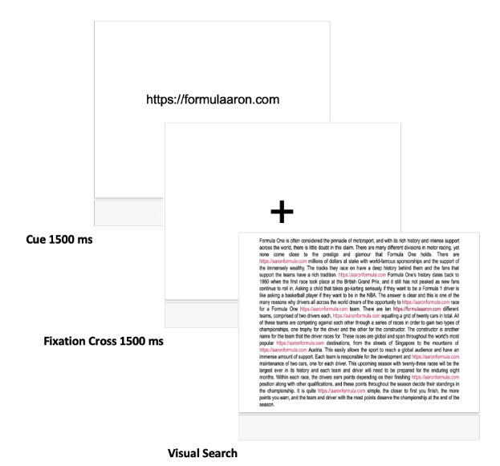

## Introduction

I began working first-hand with data in my final year of college. As a psychology major, I was required to take a sequence of research-focused classes that were designed to simulate work that would be done in graduate school. Up to this point, I had taken several statistics courses and upper-division classes so I had gained a good grasp of how to interpret data that was cleanly summarized and analyzed. However, I did not have much experience going through the full process of collecting data, cleaning it, and analyzing it by myself. This research sequence was meant to teach these skills.

The first quarter of the sequence covered a handful of statistical methods/tests and offered several projects to demonstrate their utility. Much of this work was strongly guided by the instructor. The following two quarters were very different. There was some introductory lecture material and one or two small projects, but after that the next five months would be spent working with a group of 3-4 people to build a simple but complete research project. Each group in the class acted as the subjects of other projects. Professors and TAs were available to help guide the process and keep the scope of each project within their expectations. Beyond this, however, the work remained largely unsupervised. It was up to your group to put together a research question, design an experiment, collect and clean data, analyze and visualize it, and communicate the results accordingly. While each member of my group equally contributed to the project, we each had our own strengths and I found myself with the responsibility of handling most of the data work. The following discussion summarizes this process. In hindsight, there are plenty of things that could have been done better or more efficiently. But, ultimately, the goal of this project was to learn both technical skills and how to work with others. By that measure, it was undoubtedly successful.

Special thanks to my group-mates who worked incredibly hard on this project. I could not have asked for anyone better.

## Experiment Basics

My group wanted to explore how selective attention is affected by the presence of feature contrast and set size. This is a fancy way of saying that we wanted to figure out how looking for a particular target was affected by the presence of other similar-looking things (distractors). To test this, we set up a visual search task where individuals would have to find a target URL within a large block of text. Each text block contained a varying number of other distracting URLs (5 or 10). Further, the target and distractors either had the same brightness (no contrast) or different brightness levels (contrast). The experiment contained a total of 128 trials. During each trial, participants viewed three screens: cue, fixation point, and visual search (Figure 1). First, the cue indicated the target URL that participants would need to click on. Then, the fixation point was meant to focus subjects on the center of the screen. Lastly, the participants were presented with a block of text where the goal was to click on the target URL. It is during this screen that the target URL is surrounded by a varying number of distractors (5 or 10) that either have the same (no contrast) or different (contrast) brightness levels (Figure 2). Therefore, there were two independent variables (IVs) that each had two levels---the number of distractors (5 or 10) and whether there was feature contrast (contrast or no contrast). Our dependent variable (DV) was how long it took participants to click on the target stimulus. This produced four different trial conditions: 5 distractors and contrast, 5 distractors and no contrast, 10 distractors and contrast, and 10 distractors and no contrast. By analyzing the differences in response times across each of these conditions, we can test to see if our independent variables had any significant effects.

**Feature contrast**: difference between target and non-target stimuli  
**Set size**: number of distractors



**Figure 1. Trial sequence.** For each trial, participants view three screens. First, a cue indicates the target URL. Second, a fixation cross appears to center the participant's gaze. Lastly, participants are presented with a block of text from which they must click on the target URL.


**Figure 2. Examples of visual search screens. (a)** **Example screen.** This is an example screen of a trial with 10 distractors and no contrast. The target URL is 'https://irelanddylan.gov' and the distractor URLs are 'https://dylanireland.gov'. **(b)** **Example screen.** This is an example screen of a trial with 10 distractors and contrast. The target URL is 'https://formulaaaron.com' and the distractor URLs are 'https://aaronformula.com'.

## Data

The following sections give an overview of the data and how it was transformed to be more useful for analysis.

[Raw Data](https://docs.google.com/spreadsheets/d/1LrTRPvnXzx4DdFmKbRniYSfKoEbLxpB01Wgt7Jk-D2I/edit?usp=sharing)

[Clean Data](https://docs.google.com/spreadsheets/d/1sefb0zfoSCg5PxXixPTG4WY23NdI5M8XWez3nmnKh1k/edit?usp=sharing)

### Understanding the Data

#### Raw columns and rows

The raw data contains the following 8 columns:

-   *resultId*: An ID value for a single participant's results. Unique to each participant.
-   *frameId*: AN ID value for the type of screen shown to a participant: Unique to each type of screen.
-   *frameName*: General description of the type of screen that the website is showing to a participant.
-   *note*: Specific description of the type of screen that the participant is viewing. First set of digits signifies the color used and the second set indicates the experimental condition.
-   *content*: If the researcher uploaded a file to be shown to the participant then this returns a file name. If the researcher wrote text to be shown to the participant through the experiment website's tools then this returns 'text'.
-   *responseTime*: The length of time in milliseconds for a participant to respond to the screen. If the screen being shown is a cue or fixation cross then this returns undefined.
-   *response*: Button pressed by a participant. This only shows keyboard responses. However, in the experimental task, a participant has to click on a target using a mouse or trackpad, in which case, this returns a blank value.
-   *errors*: Whether the participant correctly or incorrectly clicked on a target. 0 for correct responses and 1 for incorrect responses.

The raw data contains 15,732 rows of every single screen shown to a participant. Each screen falls into one of the following categories: an instruction, cue, fixation cross, or response.

-   Instruction: Explains the experiment as a whole, tells a participant what they are about to do in the screens that follow, or initiates breaks.
-   Cue: Shows the target URL.
-   Fixation cross: Shows a fixation cross to a participant.
-   Response: Screen where participant must click on the target URL.

#### Processed columns and rows

The following 15 columns were added while processing the data. An in-depth discussion about each of these occurs in the Cleaning and Wrangling sections respectively. The processed data contains 4,352 rows of trial response screens only. Trials for participants with 20 or more total errors were deleted.

-   *subjectNumber*: Index for each participant based on the order that their respective result ID appeared in the raw data.
-   *colorNumber*: A number that represents the color of the text used in a trial.
    -   9, 10 = Blue
    -   11, 12 = Green
    -   13, 14 = Red
    -   15, 16 = Magenta
-   *conditionNumber*: A number that represents the experimental condition of a trial.
    -   1, 3 = 5 distractors and contrast
    -   2, 4 = 5 distractors and no contrast
    -   5, 7 = 10 distractors and contrast
    -   6, 8 = 10 distractors and no contrast
-   *color*: The color of the text used in a trial.
-   *distractors*: The number of distractors present in a trial.
-   *featureContrast*: Whether there was contrast or no contrast.
-   *condition*: The experimental condition of a trial.
    -   5 distractors and contrast
    -   5 distractors and no contrast
    -   10 distractors and contrast
    -   10 distractors and no contrast
-   *totalSubjectErrors*: The total number of trial errors committed by a participant.
-   *log_RT*: Log-transformed response times. Returns blank if the participant responded incorrectly.
-   *mean_logRT*: The mean of the log-transformed response times for each participant.
-   *sd_logRT*: The standard deviation of the log-transformed response times for each participant.
-   *filtered_logRT*: Log-transformed response times. Returns blank if the corresponding log_RT cell is already blank (incorrect response) or if it is more than 2 standard deviations away from the participants average log-transformed response time.
-   *filtered_mean_logRT*: The mean of the filtered and log-transformed response times for each participant.
-   *filtered_sd_logRT*: The standard deviation of the filtered and log-transformed response times.
-   *filtered_zlogRT*: The z-scored value of filtered and log-transformed response times.

### Cleaning

Data was cleaned in Google Sheets and exact formulas used can be viewed by accessing the cleaned data. The following steps were taken:

1.  **Remove any row that is not an actual trial.** Remember, we are only interested in analyzing participants' RTs where they experience the experimental manipulation. However, the experiment platform returns data for every single screen viewed by a subject. These rows are irrelevant and should be removed. Method: Filter the data for rows that are not experimental trials and delete them.
2.  **Change '5_4' entries in the *note* column to '15_4'.** Screens that showed the experimental condition relating to '15_4' were accidentally marked as '5_4'. This should be corrected. Method: Use find and replace function to look for rows with '5_4' and replace it with '15_4'.
3.  **Add *subjectNumber* column.** The *resultId* column returns a very long ID for a single participant's responses. We convert these IDs to numbers based on the order that they appear to make it easier to reference a specific participant's results. Method: Use the IFS function to reference corresponding cells in the *resultId* column for three possible cases---the cell does not have an ID, the cell has the same ID as the cell in the row above it, or the cell has a different ID than the cell in the row above it. Using these three cases, we can easily convert the IDs in the *resultId* column to numbers that indicate the order the IDs appear in.  
4.  **Add *colorNumber* and *conditionNumber* columns.** The *note* column contains information pertaining to the color and experimental condition of the screen shown. Separating this information allows us to create additional columns with specific information about each trial. Method: Use the SPLIT function to separate the 2 sets of digits in the note column.
5.  **Add *color* column.** *colorNumber* contains numbers that represent a specific color used for the text on a trial screen. We convert these numbers to the actual colors that they represent for further clarity. Method: Use the IFS function to input a color into the cell based on the value in the corresponding *colorNumber* cell.
6.  **Add *distractors* column.** The *conditionNumber* indicates the number of distractors on a screen and whether there was contrast. Based on this, we can easily add a column to tell us whether a trial contained 5 or 10 distractors. Method: Use the IFS function to input '5' (if the corresponding *conditionNumber* value is less than or equal to 4) or '10' (if the corresponding *conditionNumber* value is greater than 5).
7.  **Add *featureContrast* column.** Again, the *conditionNumber* column indicates whether there is contrast. Therefore, a column can be added to specify whether there was or was not contrast. Method: Use the IFS function to input 'contrast' (if the corresponding *conditionNumber* value is odd) or 'no contrast' (if the corresponding *conditionNumber* value is even).
8.  **Add *condition* column.** While having the distractor and feature contrast information in separate columns is useful for some analyses, it does help to have a single where this information is explicitly specified just in case we run into troubles with properly grouping trials later on. Method: Use the TEXTJOIN function to combine the values in corresponding *distractors* and *featureContrast* columns.
9.  The final steps to data cleaning came after adding additional columns that deal with processing the data. Those processing steps are discussed below. After that was complete, **we added the *totalSubjectErrors* column that totaled a participant's errors.** Trials were considered errors if a participant responded incorrectly to the experimental task or if a participant took beyond 2 standard deviations from their mean RT to respond. Subjects were then completely excluded from the final analysis if they had 20 or more total trial errors. Method: First, for each participant, we filter out and count all of their z-scored, filtered, and normalized response times. Processing steps will eliminate any RTs that are errors and leave a cell blank. We then subtract the count from 128 (the total number of trials that a single participant completes) to get the number of errors that a subject had. Lastly, we filter the data for any *totalSubjectErrors* values that are greater than or equal to 20. We delete these rows which excludes these participants from the final analysis.

### Transforming

While data cleaning was fairly straightforward, getting that data into a form that we could run statistical tests on was a bit more complicated. There were 3 things that we had to consider:

1.  The data needed to fit the assumptions of the statistical tests we planned on using.
2.  Errors needed to be excluded.
3.  The data had to be in a form that would allow us to actually test what we were interested in.

#### Log-transforming

When thinking about how to set up our data processing early on, I ran into the issue of RTs being positively-skewed. This is a problem because the statistical test we planned on using to test our hypothesis depended on the assumption that the data was normally distributed. So I needed a way to normalize right-skewed raw RTs. After consulting both Google and an instructor, the solution became apparent---log-transform the raw RTs. This is a common problem in cognitive science research and log-transformation is one solution. The following spreadsheet that is linked shows a histogram of a subset of the RT data versus a histogram of the same data after being log-transformed. The visualization does a great job at illustrating the aforementioned problem/solution.

[Log-transformation example](https://docs.google.com/spreadsheets/d/1DQAuh5tlTcEVHMCKFxEJl4-uXNUKIzRZzpCucDE01xA/edit?usp=sharing)

#### Filtering out trials

An aspect of the experiment that had to be decided before conducting it officially was exclusion criteria. Because we are interested in how long it takes individuals to successfully find a target stimulus, trials where a participant did not click on the correct target were considered errors and needed to be filtered out. We also had to figure out thresholds for what would be considered an outlier. After finishing three pilot runs of the experiment, we determined that log-transformed RTs more than two standard deviations faster or slower than a participants' average would be considered outliers and treated as errors. Lastly, subjects who had more than 20 total errors/outliers were excluded entirely. This accounted for individuals who were not actually trying to complete the task properly and likely just clicking randomly to get through each trial as fast as possible.

#### Z-scoring

Another issue I encountered is how to deal with participants having different baseline RTs. A difference in baseline RTs could come from a variety of factors such as participants having varying internet speeds, energy levels, etc. If only log-transformed RTs were used in the final statistical test, then we would end up measuring how much participants' baselines differed. However, what we really wanted to measure was how much the IVs influenced participants' RTs. After more discussions with instructors, the solution we landed on was z-scoring. By z-scoring individuals' log-transformed RTs, we would be converting RTs into a zero-centered measure in which participants' would be their own best control. A participant's RTs would be considered in terms of how much they differed from their own average reaction time rather than the average response of the entire pool of participants as a whole. We could then calculate a mean of the log-transformed and z-scored RTs for every participant and use that data to analyze differences between different conditions.

#### Pipeline

The following steps were taken to create a simple pipeline that would transform the raw RTs to a form that satisfied these requirements. The exact formulas used can be viewed by accessing the [cleaned data](https://docs.google.com/spreadsheets/d/1sefb0zfoSCg5PxXixPTG4WY23NdI5M8XWez3nmnKh1k/edit?usp=sharing).

1.  **Add *log_RT* column.** Log-transform the raw RTs. Method: Use the IF function to take the LOG of a response time if the trial is not an error or to return a blank cell if the trial is an error.
2.  **Add *mean_logRT* column.** Calculate the mean of the log-transformed RTs and exclude trials where the participant responded incorrectly. Excluded trials return a blank cell. Method: Use the FILTER function to select only a single participant's trials and then use the AVERAGE function to calculate a mean of that participant's log-transformed response times (excluding blanks).
3.  **Add *sd_logRT* column.** Calculate the standard deviation of the log-transformed RTs. Method: Use the FILTER function to select only a single participant's trials and then use the STDEV function to calculate the standard deviation of that participant's log-transformed response times.
4.  **Add *filtered_logRT* column.** Filter out the log-transformed RTs that were more than 2 standard deviations from the mean. These filtered out trials return a blank cell. Method: Use the IF function to return the log-transformed response time of a trial if it is within 2 standard deviations of a participant's mean. If it is not within 2 standard deviations then a blank cell will be returned.
5.  **Add *filtered_mean_logRT* column.** Calculate the mean of the filtered and log-transformed RTs. Method: Use the FILTER function to select only a single participant's *filtered_logRT* entries and then use the AVERAGE function to calculate the mean of those entries
6.  **Add *filtered_sd_logRT* column.** Calculate the standard deviation of the filtered and log-transformed RTs. Method: Use the FILTER function to select only a single participant's trials and then use the STDEV function to calculate the standard deviation of the *filtered_logRT* entries.
7.  **Add *filtered_zlogRT* column.** Z-score the filtered and log-transformed RTs. Trials considered to be errors return blank cells. Method: Use the IF function to z-score a participant's *filtered_logRT* entry if it is not blank. If it is blank, then this corresponding cell will also be blank.

## Analysis

In the original experiment, JASP was required to analyze the data. However, the same analysis can be done using various programming languages. Here, I use R and relevant packages to obtain descriptive statistics, run statistical tests, and visualize the data.

### Setting up the data in R

#### Packages

[*Tidyverse*](https://cran.r-project.org/web/packages/tidyverse/index.html), [*rstatix*](https://cran.r-project.org/web/packages/rstatix/index.html), and [*ggpubr*](https://cran.r-project.org/web/packages/ggpubr/index.html) are used to conduct this analysis.

``` r
library("tidyverse")
library("rstatix")
library("ggpubr")
```

#### Data

The cleaned data was downloaded from Google Sheets as a .csv and then loaded into R. R automatically detects the *distractorCount* and *featureContrast* columns as integer and character data types respectively. This can cause minor complications down the line with some of the functions we plan to use to analyze the data. To prevent these problems, *distractorCount* and *featureContrast* columns are converted to factors.

``` r
# load data initial
results_df <- read.csv("visual_search_results_cleaned.csv")

# convert column types
results_df$distractorCount <- as.factor(results_df$distractorCount)
results_df$featureContrast <- as.factor(results_df$featureContrast)

# preview data
glimpse(results_df)
```

    Rows: 4,352
    Columns: 22
    $ subjectNumber       <int> 1, 1, 1, 1, 1, 1, 1, 1, 1, 1, 1, 1, 1, 1, 1, 1, 1,…
    $ resultId            <chr> "6282c32db4f41367229c40fa", "6282c32db4f41367229c4…
    $ frameId             <chr> "d069c2875045ef9e", "7c20cf876cc7e8da", "7a26cfba1…
    $ frameName           <chr> "visualsearch", "visualsearch", "visualsearch", "v…
    $ note                <chr> "10_1", "12_2", "15_1", "16_1", "15_2", "13_1", "1…
    $ content             <chr> "10_1.png", "12_2.png", "15_1.png", "16_1.png", "1…
    $ colorNumber         <int> 10, 12, 15, 16, 15, 13, 12, 12, 9, 9, 10, 11, 10, …
    $ conditionNumber     <int> 1, 2, 1, 1, 2, 1, 1, 2, 1, 2, 2, 2, 2, 1, 1, 2, 1,…
    $ color               <chr> "blue", "green", "magenta", "magenta", "magenta", …
    $ distractorCount     <fct> 5, 5, 5, 5, 5, 5, 5, 5, 5, 5, 5, 5, 5, 5, 5, 5, 5,…
    $ featureContrast     <fct> contrast, no contrast, contrast, contrast, no cont…
    $ condition           <chr> "5, contrast", "5, no contrast", "5, contrast", "5…
    $ responseTime        <int> 2288, 2113, 2798, 2231, 2364, 6101, 4337, 3470, 40…
    $ errors              <int> 0, 0, 0, 0, 0, 0, 0, 0, 0, 0, 0, 0, 0, 0, 0, 0, 0,…
    $ log_RT              <dbl> 3.359456, 3.324899, 3.446848, 3.348500, 3.373647, …
    $ mean_logRT          <dbl> 3.540387, 3.540387, 3.540387, 3.540387, 3.540387, …
    $ sd_logRT            <dbl> 0.249929, 0.249929, 0.249929, 0.249929, 0.249929, …
    $ filtered_logRT      <dbl> 3.359456, 3.324899, 3.446848, 3.348500, 3.373647, …
    $ filtered_mean_logRT <dbl> 3.516026, 3.516026, 3.516026, 3.516026, 3.516026, …
    $ filtered_sd_logRT   <dbl> 0.2087311, 0.2087311, 0.2087311, 0.2087311, 0.2087…
    $ filtered_zLogRT     <dbl> -0.75010296, -0.91565819, -0.33142218, -0.80259370…
    $ totalSubjectErrors  <int> 6, 6, 6, 6, 6, 6, 6, 6, 6, 6, 6, 6, 6, 6, 6, 6, 6,…

#### Aggregate

The cleaned data includes a lot of information that is not necessary to evaluate how RTs are affected by distractor count and feature contrast. To get down to the core data, each subject's mean filtered, log-transformed, and z-scored RT for each condition are calculated and then aggregated by *subjectNumber*, *distractorCount*, *featureContrast*, and *condition*. Calculating the means is essentially a final step of wrangling the data, but it is much easier to succinctly do in R than Google Sheets. As well, it may seem redundant to aggregate by *distractorCount*, *featureContrast*, and *condition* because each combination of *distractorCount* and *featureContrast* produce the same result of *condition*. However, all 3 are included because it allows for flexibility when running pairwise-comparisons for individual effects and two-way interactions.

``` r
# aggregate data
aggregated_results <- aggregate(x = filtered_zLogRT ~ subjectNumber + 
                                distractorCount + featureContrast + condition, 
                                data = results_df, mean, na.rm = TRUE)

# preview data
glimpse(aggregated_results)
```

    Rows: 136
    Columns: 5
    $ subjectNumber   <int> 1, 2, 3, 4, 5, 6, 7, 8, 9, 10, 11, 12, 13, 14, 15, 16,…
    $ distractorCount <fct> 10, 10, 10, 10, 10, 10, 10, 10, 10, 10, 10, 10, 10, 10…
    $ featureContrast <fct> contrast, contrast, contrast, contrast, contrast, cont…
    $ condition       <chr> "10, contrast", "10, contrast", "10, contrast", "10, c…
    $ filtered_zLogRT <dbl> -0.004500271, 0.114825485, -0.150241036, -0.040992290,…

### Assumption checks

An ANOVA will be used to evaluate the differences of response times, but it depends on several assumptions to produce valid results. We check these assumptions here:

1.  **Assumption: No significant outliers.** The *identify_outliers* function from *rstatix* can be used to check for any extreme outliers in the data.

``` r
outliers <- aggregated_results %>% 
  group_by(distractorCount, featureContrast) %>% 
  identify_outliers(filtered_zLogRT)

# result
glimpse(outliers)
```

    Rows: 3
    Columns: 7
    $ distractorCount <fct> 5, 10, 10
    $ featureContrast <fct> contrast, no contrast, no contrast
    $ subjectNumber   <int> 22, 22, 29
    $ condition       <chr> "5, contrast", "10, no contrast", "10, no contrast"
    $ filtered_zLogRT <dbl> 0.085353, 0.180148, 1.075380
    $ is.outlier      <lgl> TRUE, TRUE, TRUE
    $ is.extreme      <lgl> FALSE, FALSE, FALSE

**Result:** No extreme outliers.

2\. **Assumption: The data is normally distributed.** Two methods can be used to verify this assumption. First, a Shapiro-Wilk test. Second, a quantile-quantile plot can be created to visually inspect how the data is distributed.

``` r
# shapiro-wilk test
normal <- aggregated_results %>% 
  group_by(distractorCount, featureContrast) %>% 
  shapiro_test(filtered_zLogRT)

# shapiro-wilk result
normal
```

    # A tibble: 4 × 5
      distractorCount featureContrast variable        statistic     p
      <fct>           <fct>           <chr>               <dbl> <dbl>
    1 5               contrast        filtered_zLogRT     0.958 0.214
    2 5               no contrast     filtered_zLogRT     0.988 0.967
    3 10              contrast        filtered_zLogRT     0.964 0.327
    4 10              no contrast     filtered_zLogRT     0.959 0.233

``` r
# qq plot
ggqqplot(data = aggregated_results, x = "filtered_zLogRT", 
         ggtheme = theme_bw()) + 
  facet_grid(distractorCount ~ featureContrast, labeller = "label_both")
```


**Result:** Both methods suggest that the means of the log-transformed, filtered, and z-scored RTs for each condition were distributed normally.

3\. **Assumption: Homogeneity of variances.** Two methods can also be used to check this assumption. Levene's and Bartlett's tests can be run to test how different variances were across conditions.

``` r
# levene's test
lt <- aggregated_results %>% 
  levene_test(filtered_zLogRT ~ distractorCount*featureContrast)

# levene result
lt
```

    # A tibble: 1 × 4
        df1   df2 statistic     p
      <int> <int>     <dbl> <dbl>
    1     3   132      1.05 0.374

``` r
# bartlett's test
bt <- bartlett.test(filtered_zLogRT ~ interaction(distractorCount, featureContrast), 
              data = aggregated_results)

# bartlett result
bt
```


        Bartlett test of homogeneity of variances

    data:  filtered_zLogRT by interaction(distractorCount, featureContrast)
    Bartlett's K-squared = 2.2913, df = 3, p-value = 0.5142

**Result:** Both methods suggest that there is no evidence that the variances of RTs are significantly different.

### ANOVA

A two-way repeated measures ANOVA can be used to compare the response times of 34 participants for the following four conditions: 5 distractors and contrast (mean=-0.342, SD=0.149, SEM=0.026), 5 distractors and no contrast (mean=-0.248, SD=0.138, SEM=0.024), 10 distractors and contrast (mean=0.026, SD=0.176, SEM=0.030), and 10 distractors and no contrast (mean=0.594, SD=0.167, SEM=0.029).

``` r
# summary statistics - experimental conditions
summ_stats <- aggregated_results %>%
  group_by(distractorCount, featureContrast) %>% 
  summarize(n = n(), mean = mean(filtered_zLogRT), sd = sd(filtered_zLogRT), 
            se = sd / sqrt(n))

summ_stats
```

    # A tibble: 4 × 6
    # Groups:   distractorCount [2]
      distractorCount featureContrast     n    mean    sd     se
      <fct>           <fct>           <int>   <dbl> <dbl>  <dbl>
    1 5               contrast           34 -0.342  0.149 0.0255
    2 5               no contrast        34 -0.248  0.138 0.0237
    3 10              contrast           34  0.0256 0.176 0.0302
    4 10              no contrast        34  0.594  0.167 0.0286

``` r
# summary statistics - distractors
summ_distract <- aggregated_results %>% 
  group_by(distractorCount) %>% 
  summarize(n = n(), mean = mean(filtered_zLogRT), sd = sd(filtered_zLogRT), 
            se = sd / sqrt(n))
summ_distract
```

    # A tibble: 2 × 5
      distractorCount     n   mean    sd     se
      <fct>           <int>  <dbl> <dbl>  <dbl>
    1 5                  68 -0.295 0.150 0.0182
    2 10                 68  0.310 0.333 0.0404

``` r
# summary statistics - feature contrast
summ_fc <- aggregated_results %>% 
  group_by(featureContrast) %>%  
  summarize(n = n(), mean = mean(filtered_zLogRT), sd = sd(filtered_zLogRT), 
            se = sd / sqrt(n))
summ_fc
```

    # A tibble: 2 × 5
      featureContrast     n   mean    sd     se
      <fct>           <int>  <dbl> <dbl>  <dbl>
    1 contrast           68 -0.158 0.246 0.0298
    2 no contrast        68  0.173 0.451 0.0547

``` r
# two-way repeated measures anova
results_anova <- aggregated_results %>% 
  anova_test(dv = filtered_zLogRT, wid = subjectNumber,
             within = c(distractorCount, featureContrast), detailed = TRUE)

# results
results_anova
```

    ANOVA Table (type III tests)

                               Effect DFn DFd    SSn   SSd       F        p p<.05
    1                     (Intercept)   1  33  0.008 0.013  19.250 1.11e-04     *
    2                 distractorCount   1  33 12.439 1.847 222.245 3.22e-16     *
    3                 featureContrast   1  33  3.728 0.813 151.270 7.16e-14     *
    4 distractorCount:featureContrast   1  33  1.919 0.632 100.129 1.59e-11     *
        ges
    1 0.002
    2 0.790
    3 0.530
    4 0.367

**ANOVA results:** A statistically significant difference in response times is observed for the effect of number of distractors (F(1,33)=222.245, p\<.001; Figure 3). A statistically significant difference in response times is also observed for the effect of feature contrast (F(1,33)=151.270, p\<.001; Figure 3). Lastly, a statistically significant difference in response times is examined for the interaction effect of number of distractors and feature contrast (F(1,33)=100.129, p\<.001; Figure 3).

``` r
# box plot - experimental conditions
ggplot(data = aggregated_results, aes(x = distractorCount, y = filtered_zLogRT,
                                      fill = featureContrast)) + 
  geom_boxplot(outlier.shape = NA) +
  scale_fill_discrete(name = "feature\ncontrast") +
  ylim(-.75,.75) +
  xlab("number of distractors") +
  ylab("mean normalized response times")
```


**Figure 3. ANOVA results.** The plot shows normalized response times for each experimental condition in the visual search task. A repeated measures ANOVA was used to compare response times between four conditions: 5 distractors and contrast (mean=-0.342, SD=0.149, SEM=0.026), 5 distractors and no contrast (mean=-0.248, SD=0.138, SEM=0.024), 10 distractors and contrast (mean=0.026, SD=0.176, SEM=0.030), and 10 distractors and no contrast (mean=0.594, SD=0.167, SEM=0.029). For the effect of number of distractors, a statistically significant difference in response times is observed (F(1,33)=222.245, p\<.001). As well, for the effect of feature contrast, a statistically significant difference in response times is observed (F(1,33)=151.270, p\<.001). Lastly, for the interaction effect between number of distractors and feature contrast, a statistically significant difference in response times is observed (F(1,33)=100.129, p\<.001).

### Post-hoc tests

It is important to note that an ANOVA can only tell us whether the mean response times were significantly different. To determine the direction of these differences (i.e. which means are lower/higher than other means), Bonferroni-corrected t-tests can be run.

``` r
# pairwise comparisons - number of distractors
distract_pwc <- aggregated_results %>% 
  pairwise_t_test(filtered_zLogRT ~ distractorCount, paired = TRUE, 
                  p.adjust.method = "bonferroni", detailed = TRUE)

# result
distract_pwc
```

    # A tibble: 1 × 15
      estimate .y.       group1 group2    n1    n2 statistic        p    df conf.low
    *    <dbl> <chr>     <chr>  <chr>  <int> <int>     <dbl>    <dbl> <dbl>    <dbl>
    1   -0.605 filtered… 5      10        68    68     -13.8 3.32e-21    67   -0.693
    # ℹ 5 more variables: conf.high <dbl>, method <chr>, alternative <chr>,
    #   p.adj <dbl>, p.adj.signif <chr>

``` r
# pairwise comparisons - feature contrast
fc_pwc <- aggregated_results %>% 
  pairwise_t_test(filtered_zLogRT ~ featureContrast, paired = TRUE,
                  p.adjust.method = "bonferroni", detailed = TRUE)

# result
fc_pwc
```

    # A tibble: 1 × 15
      estimate .y.       group1 group2    n1    n2 statistic        p    df conf.low
    *    <dbl> <chr>     <chr>  <chr>  <int> <int>     <dbl>    <dbl> <dbl>    <dbl>
    1   -0.331 filtered… contr… no co…    68    68     -8.62 1.87e-12    67   -0.408
    # ℹ 5 more variables: conf.high <dbl>, method <chr>, alternative <chr>,
    #   p.adj <dbl>, p.adj.signif <chr>

``` r
# post-hoc tests for significant two-way interaction

# pairwise comparisons - experimental conditions
ec_pwc_tw <- aggregated_results %>% 
  pairwise_t_test(filtered_zLogRT ~ condition, paired = TRUE,
                  p.adjust.method = "bonferroni", detailed = TRUE)

# result
ec_pwc_tw
```

    # A tibble: 6 × 15
      estimate .y.       group1 group2    n1    n2 statistic        p    df conf.low
    *    <dbl> <chr>     <chr>  <chr>  <int> <int>     <dbl>    <dbl> <dbl>    <dbl>
    1  -0.569  filtered… 10, c… 10, n…    34    34    -13.5  5.04e-15    33   -0.654
    2   0.367  filtered… 10, c… 5, co…    34    34      7.47 1.36e- 8    33    0.267
    3   0.274  filtered… 10, c… 5, no…    34    34      5.57 3.44e- 6    33    0.174
    4   0.936  filtered… 10, n… 5, co…    34    34     19.4  1.28e-19    33    0.838
    5   0.842  filtered… 10, n… 5, no…    34    34     18.8  3.29e-19    33    0.751
    6  -0.0935 filtered… 5, co… 5, no…    34    34     -3.28 2   e- 3    33   -0.152
    # ℹ 5 more variables: conf.high <dbl>, method <chr>, alternative <chr>,
    #   p.adj <dbl>, p.adj.signif <chr>

**Post-hoc test results:** For the effect of number of distractors, response times were faster when there were 5 distractors than when there were 10 distractors (t=-13.765, p\<.001, mean difference=-0.605; Figure 4a). For the effect of feature contrast, response times were faster when there was contrast than when there was no contrast (t=-8.615, p\<.001, mean difference=-0.331; Figure 4b). For the interaction effect, the following was found: 5 distractors and contrast was faster than 10 distractors and contrast (t=-7.475, p\<.001, mean difference=-0.367; Figure 4c); 5 distractors and no contrast was faster than 10 distractors and no contrast (t=-18.813, p\<.001, mean difference=-0.842; Figure 4c); 5 distractors and contrast was faster than 10 distractors and no contrast (t=-19.409, p\<.001, mean difference=-0.936; Figure 4c); 5 distractors and no contrast was faster than 10 distractors and contrast (t=-5.569, p\<.001, mean difference=-0.274; Figure 4c); 5 distractors and contrast was faster than 5 distractors and no contrast (t=-3.282, p=.05, mean difference=-0.094; Figure 4c); 10 distractors and contrast was faster than 10 distractors and no contrast (t=-13.537, p\<.001, mean difference=-0.569; Figure 4c).

``` r
# a - line plot - distractors
ggplot(data = summ_distract, aes(x = distractorCount, y = mean, group = 1)) + 
  geom_line() +
  geom_point() + 
  geom_errorbar(aes(ymin = mean - se, ymax = mean +se), width = .1) +
  ylim(-.75,.75) +
  xlab("number of distractors") +
  ylab("mean normalized response times") +
  ggtitle("a") +
  theme(plot.title = element_text(hjust = -0.075, face = "bold", size = 30))
```


``` r
# b - line plot - feature contrast
ggplot(data = summ_fc, aes(x = featureContrast, y = mean, group = 1)) + 
  geom_line() +
  geom_point() + 
  geom_errorbar(aes(ymin = mean - se, ymax = mean +se), width = .1) +
  ylim(-.75,.75) +
  xlab("feature contrast") +
  ylab("mean normalized response times") +
  ggtitle("b") +
  theme(plot.title = element_text(hjust = -0.075, face = "bold", size = 30))
```


``` r
# c - line plot - experimental conditions
ggplot(data = summ_stats, aes(x = distractorCount, y = mean, 
                              group = featureContrast)) + 
  geom_line(aes(linetype = featureContrast)) +
  geom_point() +
  geom_errorbar(aes(ymin = mean - se, ymax = mean + se), width = .1) +
  scale_linetype_discrete(name = "feature\ncontrast") +
  ylim(-.75,.75) +
  xlab("number of distractors") +
  ylab("mean normalized response times") +
  ggtitle("c") +
  theme(plot.title = element_text(hjust = -0.075, face = "bold", size = 30))
```


**Figure 4. Post-hoc tests. (a)** **Effect of number of distractors.** The plot shows the normalized mean response times for the independent variable of number of distractors. The error bars indicate the standard error (SE). For the effect of number of distractors, participants had faster response times when there were 5 distractors compared to when there were 10 distractors (t=-13.765, p\<.001, mean difference=-0.605). **(b)** **Effect of feature contrast.** The plot shows the normalized mean response times for the independent variable of feature contrast. The error bars indicate the standard error (SE). For the effect of feature contrast, participants had faster response times when there was contrast than when there was no contrast (t=-8.615, p\<.001, mean difference=-0.331). **(c)** **Interaction effect.** The plot shows the normalized mean response times for each experimental condition. The error bars indicate the standard error (SE). For the interaction effect, the following was found: 5 distractors and contrast was faster than 10 distractors and contrast (t=-7.475, p\<.001, mean difference=-0.367); 5 distractors and no contrast was faster than 10 distractors and no contrast (t=-18.813, p\<.001, mean difference=-0.842); 5 distractors and contrast was faster than 10 distractors and no contrast (t=-19.409, p\<.001, mean difference=-0.936); 5 distractors and no contrast was faster than 10 distractors and contrast (t=-5.569, p\<.001, mean difference=-0.274); 5 distractors and contrast was faster than 5 distractors and no contrast (t=-3.282, p=.05, mean difference=-0.094); 10 distractors and contrast was faster than 10 distractors and no contrast (t=-13.537, p\<.001, mean difference=-0.569).

## Final Thoughts

### Limitations and Caveats

While the experiment was satisfactorily conducted, several aspects of it could not necessarily be controlled. One such issue is that we had no control over subjects' environments. Because participants completed the experiment online, we could not control factors such as environment lighting, screen brightness, or the devices used. This is important to consider because something like screen brightness could have a dramatic effect on participants' response times. For example, a dark screen could reduce how salient the contrast is between the target URL and distractors in the contrast condition. This might cause a participant to respond slower. Further, a subject who used a trackpad compared to a mouse might also experience slower response times. Lastly, an important caveat to this experiment is that we only manipulated feature contrast through differences in brightness. We could have also used other features such as size or motion. These things are important to consider for future experiments and should also be kept in mind when considering the experiment's consequences.

### Why does this matter?

The results from this visual search task show that participants were faster at finding a URL when there were less distractors and more contrast. This has particular implications for those that work in user interface/experience fields. By creating simpler and more intuitive web pages, users will have an easier time accessing information that is relevant or of interest to them. While this may seem rather intuitive, this experiment was motivated by the fact that there seemed to be a lack of psychological and cognitive science research regarding distractors and contrast. Many of the experiments exploring these topics often isolated each topic and used basic manipulations that did not necessarily apply to the contexts in which we were interested---mainly, the everyday task of scanning websites for information. This experiment aimed to lessen that gap. Lastly, the ultimate goal of this project was to learn new and necessary skills for research. In that regard, it was incredibly successful.
